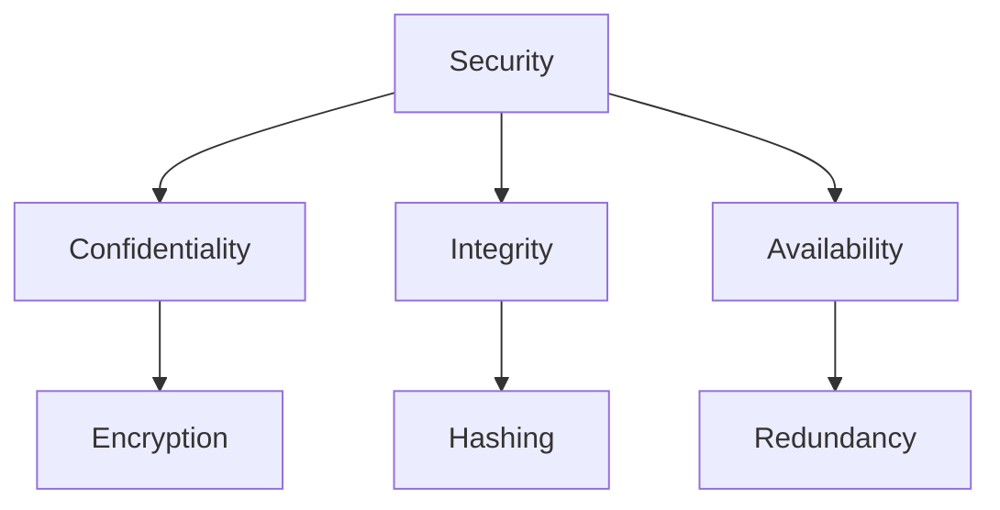
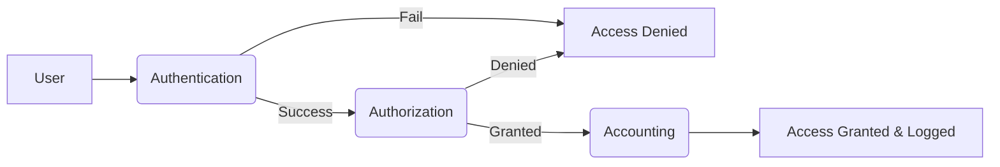
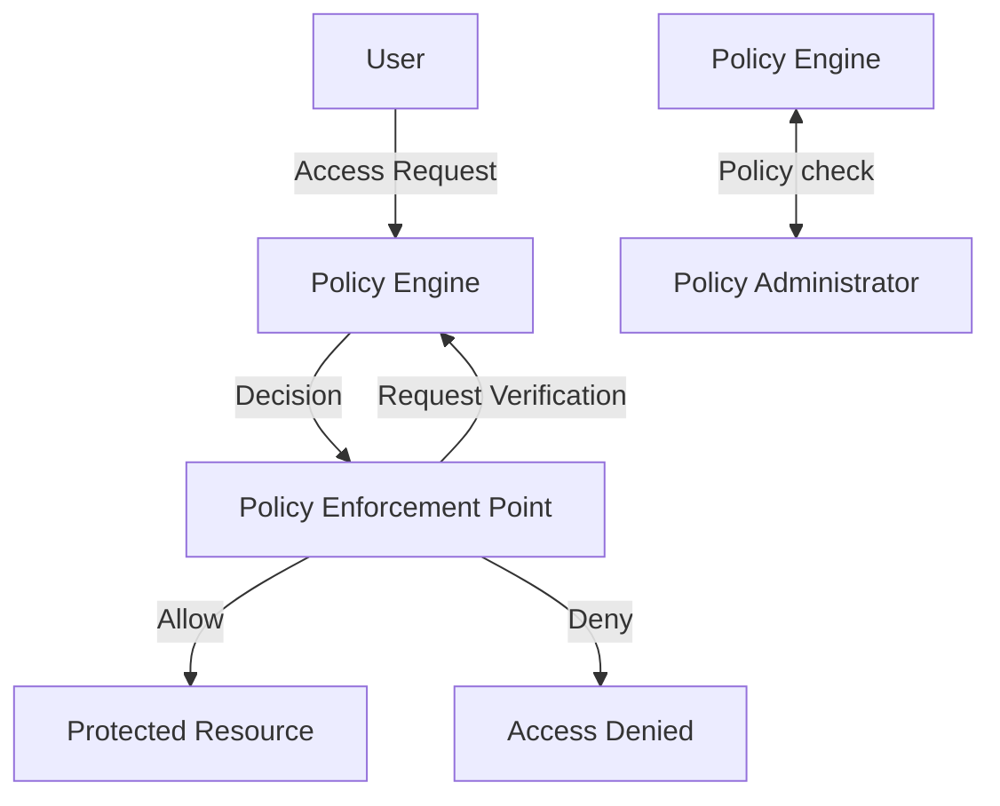

# Fundamental Security Concepts

## Confidentiality, Integrity, and Availability (CIA Triad)

The CIA triad forms the cornerstone of information security, guiding policies and security measures.

1.    - **Confidentiality**: Ensuring information is accessible only to authorized individuals
        - **Techniques**: Encryption, Access Controls, Data Masking

2.    - **Integrity**: Integrity ensures the accuracy and reliability of data by preventing unauthorized alterations
        - **Techniques**: Hashing, digital signatures, and access control measures

3.    - **Availability**: Ensuring authorized users have reliable and timely access to information and resources
        - **Techniques**: Redundancy, failover systems, backup systems, and regular maintenance

### CIA Triad Diagram

## Non-repudiation

Non-repudiation ensures that actions or transactions cannot be denied by the parties involved.

 1.   - Achieved through audit logging, digital signatures, and certificates.

## Authentication, Authorization, and Accounting (AAA)

1.    - **Authentication**: Verifying identity of users or systems.
        -**Methods**: passwords, biometrics, tokens

    
2.    - **Authorization**: Granting access based on confirmed identity.
        - **Methods**: Access Control Lists (ACLs), role-based access control (RBAC), or attribute-based access control (ABAC)

    
3.    - **Accounting**: Tracking user actions for auditing and analysis
        - **Methods**: Logs including user access logs, session tracking, resource utilization.

### AAA Process

## Gap Analysis

A systematic evalutation process to determine the difference between the current security state and the desired security posture.

1.    -  Helps identify security improvements needed and prioritize resources.

## Zero Trust Security

Zero Trust is a security model that requires verification for all resources and assumes no implicit trust.

1.    - **Control Plane Components**:
        - Adaptive Identity
        - Policy-driven access control
        - Policy Administrator
        - Policy Engine

2.    - **Data Plane Components**:
        - Policy Enforcement Points (PEP)
        - Subject/System validation

### Zero Trust Architecture

## Deception and Disruption Technologies

Technologies designed to mislead attackers and reduce likelihood of successful breaches.

1.    - **Honeypot**: Decoy system designed to attract attackers
2.    - **Honeynet**: Network of honeypots
3.    - **Honeyfile**: Fake file designed to detect access or theft attempts
4.    - **Honeytoken**: Decoy credential or data used to detect unauthorized access

